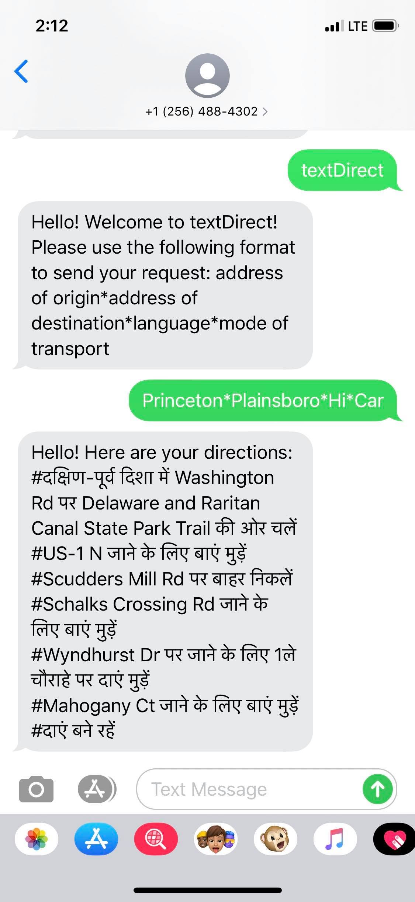

# TextDirect

Large number of people in several countries cannot avail GPS technologies due to 

- Lack of financial resources to purchase smartphones with GPS applications like Google Maps.
- Poor penetration of internet and mobile data services in the regions they reside in.

However, most have feature phones equipped with text messaging capabilities. TextDirect is an SMS-based navigation service that delivers step by step directions between two locations.


### Dependencies

- ngrok (follow https://ngrok.com/download)
- Google Directions API 
- Twillio API (Python)
- Flask

Flask App deployed on Heroku.

### Usage

Send the following message to (+1) 256-488-4302:
  
```
textdirect
```

You will then be guided to send your directions request in specified format. Send it in and you will soon receive your direction. For example:




